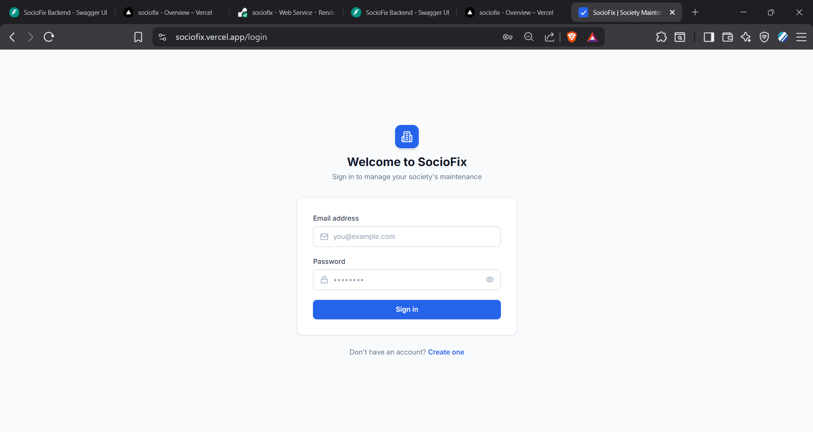
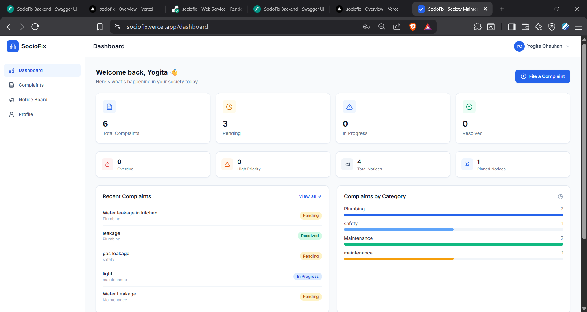
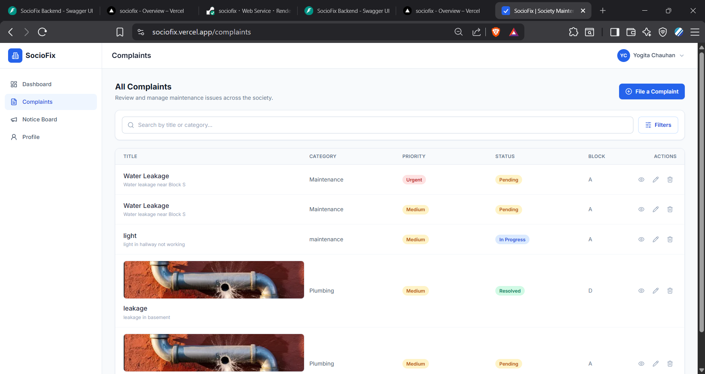
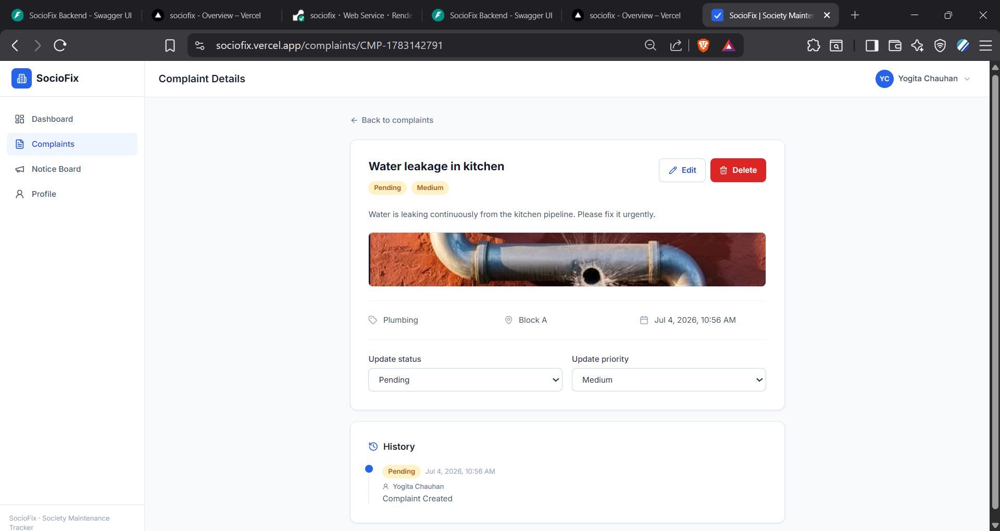
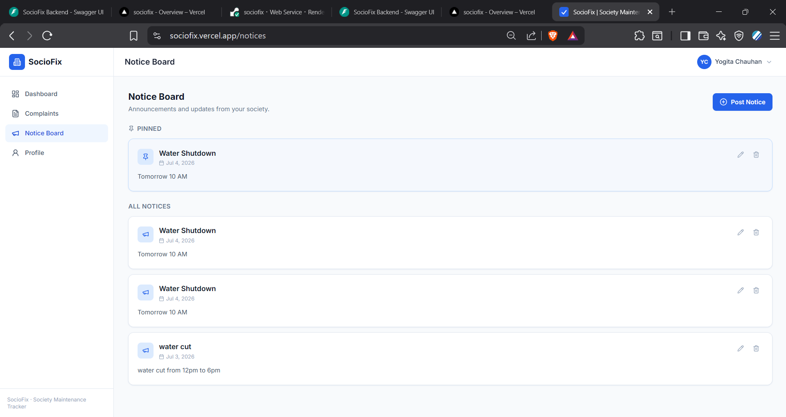
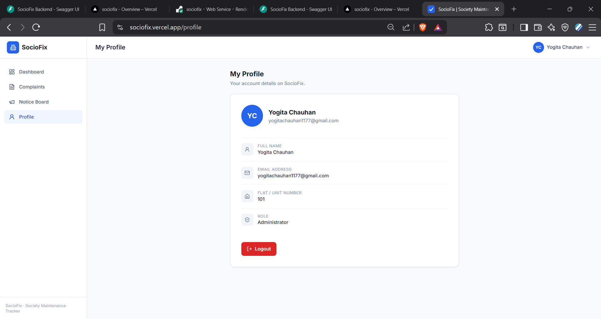

# 🏢 SocioFix – Society Maintenance Management System

SocioFix is a full-stack web application that streamlines complaint management and society maintenance operations. It enables residents to raise maintenance complaints while allowing administrators to efficiently track, manage, prioritize, and resolve issues through a centralized dashboard.

---

## 📌 Features

### 👤 Authentication
- Secure JWT-based authentication
- User Registration & Login
- Role-based authorization (Resident/Admin)
- Protected routes
- Persistent user sessions

### 🛠 Complaint Management
- Create maintenance complaints
- Upload complaint images
- View complaint details
- Edit complaints
- Delete complaints
- Complaint status tracking
- Priority management
- Complaint history
- Search complaints
- Filter complaints by:
  - Status
  - Category
  - Priority
  - Block
  - Date

### 📢 Notice Board
- Create notices
- Edit notices
- Delete notices
- Pin/Unpin important notices
- View latest announcements

### 📊 Dashboard
- Total complaints
- Pending complaints
- In Progress complaints
- Resolved complaints
- High priority complaints
- Overdue complaints
- Complaint category statistics
- Recent complaints
- Latest notices

### 👤 User Profile
- View profile
- Update profile information

---

# 🛠 Tech Stack

## Frontend

- React.js
- Vite
- Tailwind CSS
- React Router DOM
- Axios
- React Hot Toast
- Lucide React Icons

---

## Backend

- FastAPI
- Python
- JWT Authentication
- Pydantic
- Uvicorn

---

## Database

- MongoDB

---

## Deployment

Frontend:
- Vercel

Backend:
- Render

---

# 📂 Project Structure

```
SocioFix
│
├── backend
│   ├── app
│   │
│   ├── auth
│   ├── complaints
│   ├── dashboard
│   ├── notices
│   ├── profile
│   ├── database
│   ├── core
│   └── main.py
│
└── sociofix-frontend
    ├── public
    ├── src
    │
    ├── api
    ├── components
    ├── context
    ├── pages
    ├── utils
    └── App.jsx
```

---

# 🚀 Live Demo

### Frontend

https://sociofix.vercel.app

### Backend API

https://sociofix-zwxz.onrender.com

### API Documentation (Swagger)

https://sociofix-zwxz.onrender.com/docs

---

# ⚙ Installation

## Clone Repository

```bash
git clone https://github.com/yogita1177/sociofix.git
```

```bash
cd sociofix
```

---

## Backend Setup

```bash
cd backend
```

Create virtual environment

```bash
python -m venv venv
```

Activate

Windows

```bash
venv\Scripts\activate
```

Linux/Mac

```bash
source venv/bin/activate
```

Install dependencies

```bash
pip install -r requirements.txt
```

Create a `.env` file

```env
APP_NAME=SocioFix

SECRET_KEY=your_secret_key

ACCESS_TOKEN_EXPIRE_MINUTES=60

MONGODB_URL=your_mongodb_connection_string

DATABASE_NAME=sociofix

CORS_ORIGINS=http://localhost:5173,https://sociofix.vercel.app
```

Run backend

```bash
uvicorn app.main:app --reload
```

---

## Frontend Setup

```bash
cd sociofix-frontend
```

Install packages

```bash
npm install
```

Create `.env`

```env
VITE_API_BASE_URL=http://localhost:8000/api
```

For production

```env
VITE_API_BASE_URL=https://sociofix-zwxz.onrender.com/api
```

Run frontend

```bash
npm run dev
```

---

# 🔐 User Roles

## Resident

- Register/Login
- File complaints
- Edit own complaints
- Delete own complaints
- Track complaint status
- View notices
- Update profile

---

## Admin

- View all complaints
- Manage complaint priority
- Update complaint status
- Delete complaints
- Manage notices
- View analytics dashboard

---

## 📷 Screenshots

### Login



### Dashboard



### Complaints



### Complaint Details



### Notice Board



### Profile


---

# 🔄 API Endpoints

## Authentication

```
POST   /api/auth/register
POST   /api/auth/login
GET    /api/auth/me
```

---

## Complaints

```
GET     /api/complaints
GET     /api/complaints/my
GET     /api/complaints/{id}
POST    /api/complaints
PUT     /api/complaints/{id}
DELETE  /api/complaints/{id}
PATCH   /api/complaints/{id}/status
PATCH   /api/complaints/{id}/priority
```

---

## Dashboard

```
GET /api/dashboard
```

---

## Notices

```
GET
POST
PUT
DELETE
```

---

# ✨ Future Improvements

- Email notifications
- SMS alerts
- Complaint assignment to maintenance staff
- Real-time notifications
- Complaint voting
- Resident discussion forum
- Payment gateway integration
- Maintenance scheduling
- Mobile application

---

# 👩‍💻 Author

**Yogita Chauhan**

B.Tech Computer Science Engineering

GitHub: https://github.com/yogita1177

LinkedIn: *(Add your LinkedIn URL here)*

---

# 📄 License

This project was developed for educational and learning purposes.

---